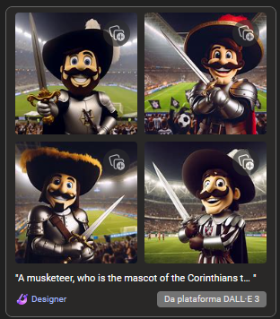
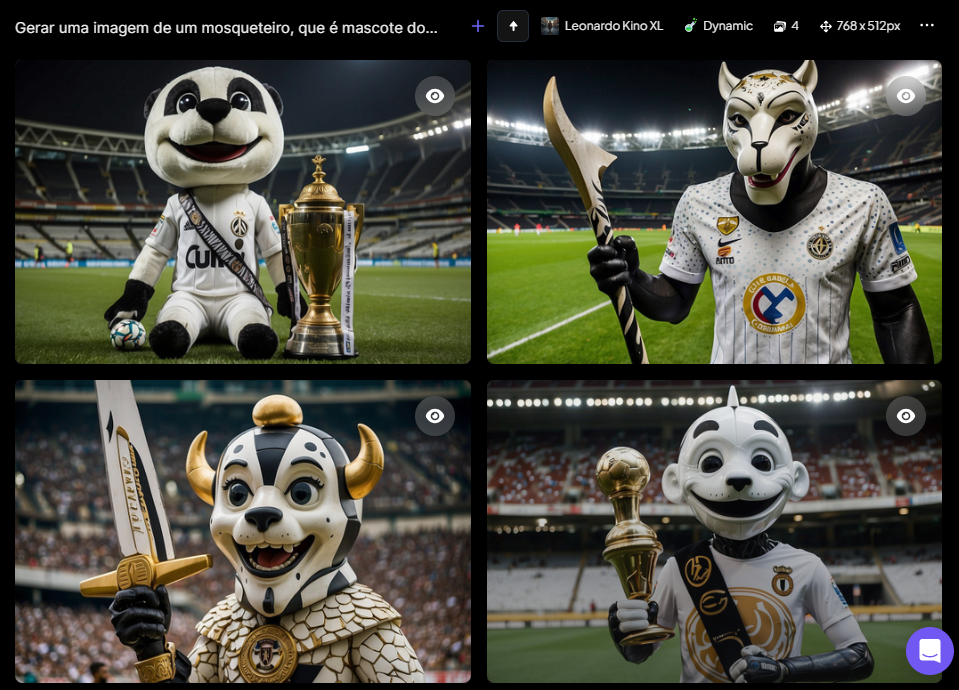

# Aula: Natural ou Fake Natty? Como Vencer na Era das IAs Generativas!

## 📒 Descrição
Aproveitando o projeto da DIO, minha ideia aqui será explorar as ferramentas de IA apresentadas no curso.

## 🤖 Tecnologias Utilizadas
Liste as IAs Generativas e outras ferramentas usadas

* Apresentações: criação de slides através do Gamma com IA generativa.
* Chatbots: ChatGPT e API, Copilot, Gemini.
* Geradores de Imagens: Copilot, Leonardo AI e Midjourney.
* Vozes e Avatares Virtuais: ElevenLabs, D-ID e HeyGen.

## 🧐 Processo de Criação
Descreva como você criou o conteúdo

### Criação de apresentações com Gamma.app
* Entrar no site da Gamma: https://gamma.app/
* Criar um usuário, onde no meu caso criei com o meu usuário Google.
* Coloquei o seguinte prompt: "Criar um curso de utilização de IA na prática".
* Exportei como PPT na minha máquina, para salvar o conteúdo.
* Gerei um compartilhamento da apresentação.

### Uso de chatbots 

Utilizando estes assistentes de linguagem natural, existem algumas funcionalidades básicas que podem ser exploradas:
* Resumo de texto
* Extração de informações
* Resposta à pergunta
* Classificação de texto
* Conversação
* Geração de código
* Raciocínio

Vou exemplificar o resultado obtido para cada uma das plataformas, utilizando a funçaão de Resumo de um texto maior.

O texto eu solicitei ao Copilot para gerar um texto com o seguinte prompt:

>Como um jornalista, crie um texto com 3 parágrafos explicando como é o processo de criar uma matéria jornalística.

Resultado:

>O processo de criação de uma matéria jornalística começa com a identificação e seleção de um tópico relevante. Isso pode ser um evento atual, uma questão social emergente, ou qualquer assunto que seja de interesse público. O jornalista precisa estar sempre atento ao que está acontecendo ao seu redor e ser capaz de identificar histórias potenciais que possam interessar aos leitores.
>
>Após a seleção do tópico, o jornalista realiza uma pesquisa aprofundada sobre o assunto. Isso pode envolver a leitura de artigos relacionados, entrevistas com especialistas ou pessoas envolvidas, e a coleta de dados de várias fontes. O objetivo é obter uma compreensão completa do tópico para poder apresentá-lo de forma clara e precisa para o público.
>
>Finalmente, o jornalista escreve a matéria, garantindo que a informação seja apresentada de forma objetiva e equilibrada. A matéria deve ser escrita de forma atraente e envolvente, mantendo a precisão e a integridade das informações. Após a escrita, a matéria passa por um processo de revisão e edição antes de ser publicada. Este é um resumo simplificado do processo, e cada matéria pode exigir abordagens e etapas adicionais dependendo de sua complexidade e do meio em que será publicada.

Nisto, usarei o seguinte prompt para realizar a operação de resumo:

>Resuma o texto a seguir em apenas uma sentença: [Colar o texto aqui]

### Uso de geradores de imagens

Prompt: Gerar uma imagem de um mosqueteiro, que é mascote do time Corinthians, segurando uma espada. Ele está sorrindo pois foi campeão de futebol. Ao fundo, colocar um estádio de futebol lotado, porém desfocado.

## 🚀 Resultados
Apresente os resultados do seu projeto

### Resultados do uso de geradores de apresentações

* Apresentação sobre curso de IA na prática gerado pelo Gamma.app: [Link](https://gamma.app/docs/lyynpol8wqe138g?token=&following_id=9iku8bgp2jhq0gm&follow_on_start=true)

### Resultados do uso de assistentes

#### ChatGPT

>O processo de criação de uma matéria jornalística envolve a identificação de um tópico relevante, pesquisa aprofundada para obter uma compreensão completa do assunto e a escrita objetiva e equilibrada da matéria, seguida por revisão e edição antes da publicação, adaptando-se à complexidade e ao meio de publicação específico.

#### Copilot

>A criação de uma matéria jornalística envolve a identificação de um tópico relevante, a realização de uma pesquisa aprofundada e a escrita da matéria de forma objetiva e equilibrada, seguida de revisão e edição antes da publicação.

#### Gemini

>A criação de uma matéria jornalística envolve pesquisa, apuração e redação para apresentar um tema relevante de forma clara, objetiva e equilibrada ao público.

### Resultados do uso de geradores de imagens

#### Copilot

#### Leonardo AI

#### Midjourney

Não consegui gerar pois só aceita no plano pago. Isto pelo Discord. No site, dizem que estão desenvolvendo e estará disponível em breve.

## 💭 Reflexão (Opcional)

Comente sobre o desafio de criar algo 'natty' com IA.

Foi uma experiência interessante, pois eu só havia lido a respeito e colocar a mão na massa, realmente traz uma experiência muito mais relevante.

Creio que a engenharia de prompts passa a ser um ponto relevante para o meu aprendizado em IA e este deve ser meu próximo passo neste assunto.
